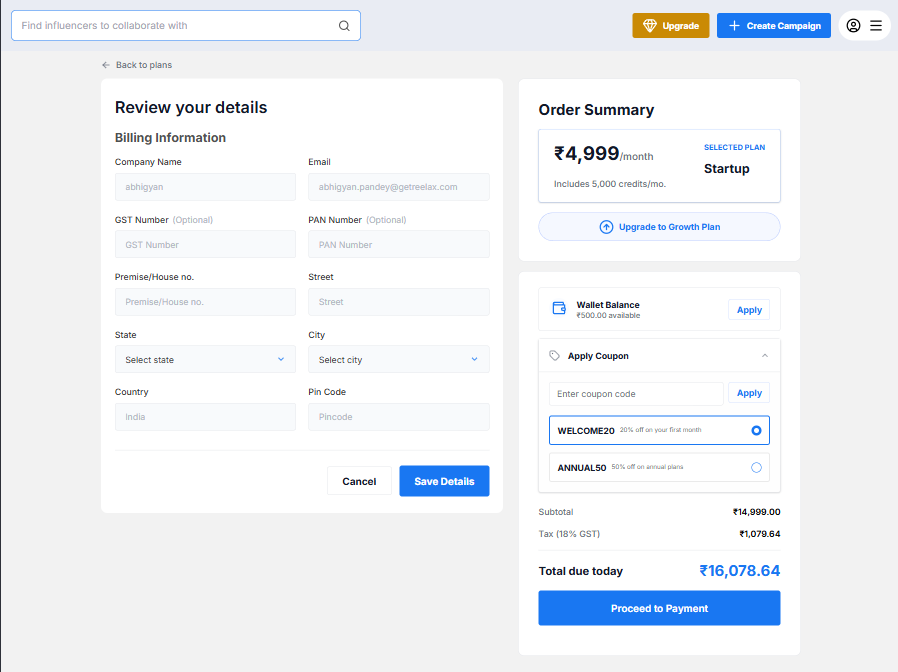

# Reelax Checkout Page Assignment

A pixel-perfect and fully responsive implementation of the Reelax checkout page UI using React JS and Tailwind CSS based on the provided Figma design.

---

## Live Demo

🔗 Live Website: https://ecommerce-store-nu-pied.vercel.app/

## GitHub Repository

🔗 Repository: https://github.com/vishalpohar/reelax-assignment

---

## Assignment Objective

The objective of this project was to recreate the provided Figma design as a responsive and component-based React application while maintaining:

- Pixel-perfect UI accuracy
- Clean component architecture
- Responsive design implementation
- Reusable UI components
- Proper spacing, typography, and color consistency

---

## Tech Stack

- **Framework:** React JS
- **Build Tool:** Vite
- **Styling:** Tailwind CSS
- **Icons:** Lucide React
- **Font:** Inter (Google Fonts)

---

## Features

- Fully responsive checkout page UI
- Component-based architecture
- Reusable Button, Input, Select, and Radio components
- Animated mobile navigation menu
- Interactive coupon selection
- Custom styled select dropdown
- Responsive grid layout
- Accessible form fields and buttons
- Clean and maintainable code structure

---

## Responsive Design

The UI is optimized for:

- Mobile Devices
- Tablets
- Desktop Screens

Responsive breakpoints were implemented using Tailwind CSS utilities.

---

## Project Structure

```bash
src/
│
├── components/
│   ├── common/
│   │   ├── Button.jsx
│   │   ├── InputField.jsx
│   │   ├── RadioOption.jsx
│   │   └── SelectField.jsx
│   │
│   ├── checkout/
│   │   ├── BillingForm.jsx
│   │   ├── CouponSection.jsx
│   │   ├── OrderSummary.jsx
│   │   └── PaymentSummary.jsx
│   │
│   └── layout/
│       └── Header.jsx
│
├── data/
│   └── locationData.js
│
├── pages/
│   └── CheckoutPage.jsx
│
├── App.jsx
├── App.css
├── index.css
└── main.jsx
```

---

## Screenshots

### Checkout Page


---

## Installation & Setup

### Clone the Repository

```bash
git clone https://github.com/vishalpohar/reelax-assignment.git
```

### Navigate to the Project Directory

```bash
cd reelax-assignment
```

### Install Dependencies

```bash
npm install
```

## Run the Application

```bash
npm run dev
```

---

### Design Reference
* Figma Design: https://www.figma.com/design/MKdNApMQd3YFkR1DgFaTwS/Assignment?node-id=0-3

## Author

### Vishal Pohar

* GitHub: https://github.com/vishalpohar
* Email: [vishalpohar11@gmail.com](mailto:vishalpohar11@gmail.com)


### License

This project was created for the Reelax frontend assignment submission.